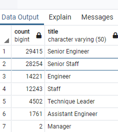

# Pewlett-Hackard-Analysis.
====

1. Overview of the analysis:
> The purpose of this analysis is to find out which employees in Pewlett-Hackard were close to retiring and who would eventually replace them in the future. To do that we added all the employee credentials in a database. These credentials include Age, sex, date of employment, date of retirement, employment number, and mentorship eligibility. With this data we were able to determine how many employees would soon be heading into retirement and how many positions they will leave in their wake.

2. Results:

 
> 
- In our Postgres analysis we have tabulated the titles of the employees, how long they have worked on the company, and weather or not they are eligible for retirement.

- from the image above, we can see a whopping 28,254 which is approximately 30% of the employees that will be retiring soon and that is just the **Senior Employees**.

- Another thing to note is that the title with the most vacancy in the future will be engineers. This means that company will have to look for individuals with this skill set.

- From this we can also say that the company does not have enough current employees to fill this gap.

3. Summary:
> Based on the findings of our analysis Pewlett-Hackard must fill the shoes of over 90,000 employees over the course of 5 years. In addition to that it must fill these vacancies from other sources outside of the company.

..